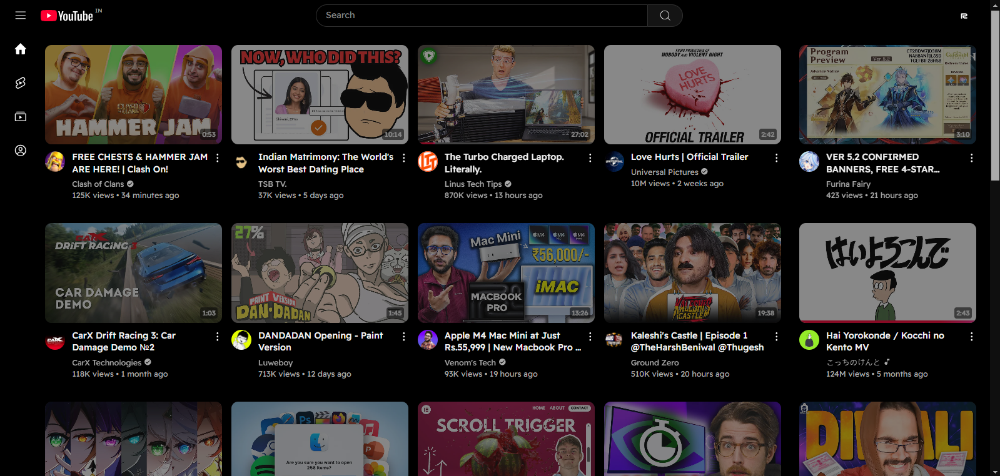
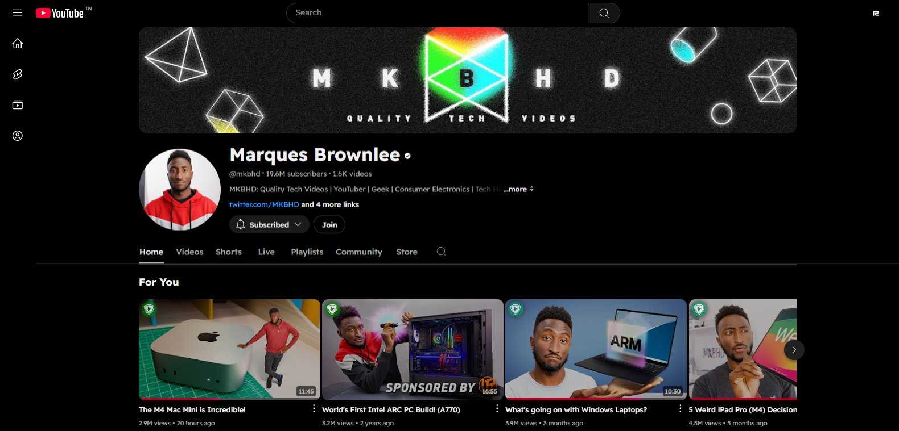
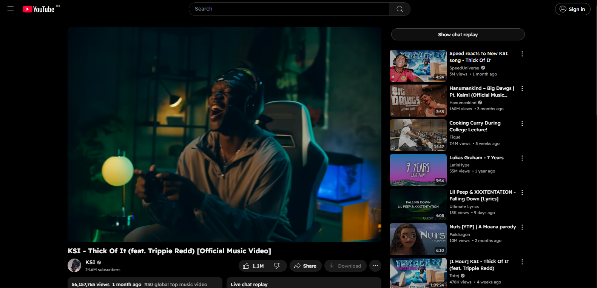

# RacistYT
RacistYT - A Pure Black Theme for YouTube, because I hate the current dark and light modes.


## Features
- Black Theme
- Change Fonts(Restart the page after selecting the font.)
- Remove some useless elements
- Thumbnails opactity is decreased so they don't blind you.

More to come.

## Screenshots





## Installation

1. Download or Clone the Repo
```
git clone https://github.com/your-username/theme-font-selector-extension.git
```
2. Enable Devleoper Mode from Extension

3. Drag and Drop the Zip file or Load Unpacked

4. Done.

## License

[MIT](https://github.com/RayX81194/racistyt/blob/main/LICENSE)
 
